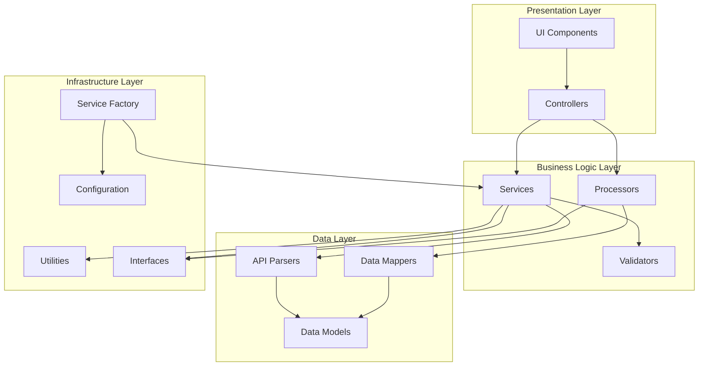
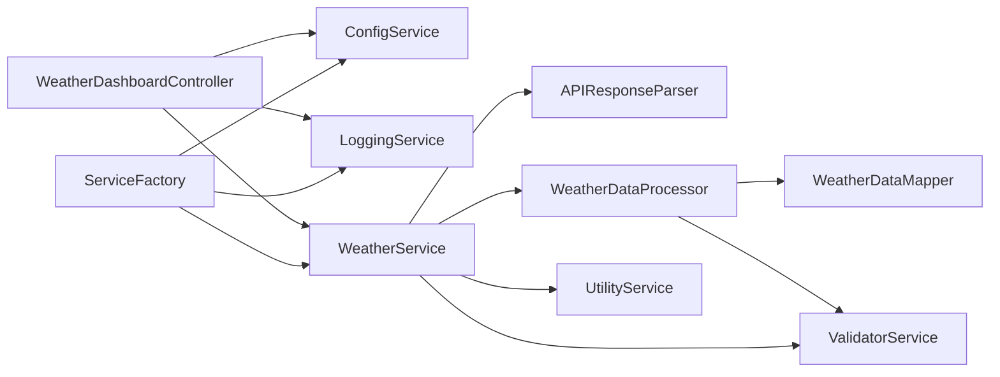

# Weather Dashboard Architecture Documentation

## Overview

This document describes the refactored architecture of the Weather Dashboard application, which has been transformed from a monolithic structure into a modular, maintainable system following SOLID principles and modern software architecture patterns.

## Architecture Principles

### SOLID Principles Implementation

- **Single Responsibility Principle (SRP)**: Each class and module has a single, well-defined responsibility
- **Open/Closed Principle (OCP)**: Components are open for extension but closed for modification through interfaces
- **Liskov Substitution Principle (LSP)**: Implementations can be substituted without breaking functionality
- **Interface Segregation Principle (ISP)**: Interfaces are specific and focused on particular use cases
- **Dependency Inversion Principle (DIP)**: High-level modules depend on abstractions, not concretions

### Design Patterns Used

- **Dependency Injection**: Service container manages object creation and dependencies
- **Factory Pattern**: ServiceFactory creates and configures services
- **Strategy Pattern**: Different weather service implementations through interfaces
- **Observer Pattern**: Event-driven UI updates through controllers
- **Data Mapper Pattern**: Transformation between different data models
- **Repository Pattern**: Data access abstraction through service interfaces

## Component Architecture

### Directory Structure

```
src/
├── config/                 # Configuration management
│   ├── __init__.py
│   └── app_config.py       # Centralized application configuration
├── controllers/            # UI event handling and coordination
│   ├── __init__.py
│   └── weather_dashboard_controller.py
├── interfaces/             # Abstract base classes and contracts
│   ├── __init__.py
│   └── weather_service_interface.py
├── mappers/               # Data transformation between models
│   ├── __init__.py
│   └── weather_data_mapper.py
├── models/                # Data models and structures
│   ├── __init__.py
│   ├── app_models.py
│   └── weather_models.py
├── parsers/               # API response parsing and validation
│   ├── __init__.py
│   └── api_response_parser.py
├── processors/            # Business logic and data processing
│   ├── __init__.py
│   └── weather_processor.py
├── services/              # Service layer implementation
│   ├── __init__.py
│   ├── config_service.py
│   ├── enhanced_weather_service.py
│   ├── logging_service.py
│   ├── service_factory.py
│   ├── utility_service.py
│   ├── validator_service.py
│   └── weather_service.py
├── ui/                    # User interface components
│   ├── __init__.py
│   ├── components/
│   ├── professional_weather_dashboard.py
│   ├── theme.py
│   └── weather_dashboard.py
└── utils/                 # Utility functions and helpers
    ├── __init__.py
    ├── formatters.py
    ├── helpers.py
    └── validators.py
```

## Component Diagram



## Service Interaction Flow

### Weather Data Retrieval Flow

1. **User Input** → UI Component receives search input
2. **Validation** → ValidatorService validates location input
3. **Controller** → WeatherDashboardController processes the request
4. **Service Call** → WeatherService fetches data from API
5. **Parsing** → APIResponseParser validates and parses response
6. **Processing** → WeatherDataProcessor transforms raw data
7. **Mapping** → WeatherDataMapper converts to UI model
8. **Display** → UI components render the processed data

### Service Dependencies



## Data Flow Documentation

### Data Transformation Pipeline

1. **Raw API Response** (JSON)
   ↓
2. **APIResponseParser** → Validates structure and extracts data
   ↓
3. **WeatherDataProcessor** → Applies business logic and calculations
   ↓
4. **WeatherDataMapper** → Transforms to appropriate model (UI/Storage/API)
   ↓
5. **UI Components** → Renders formatted data

### Data Models

- **APIWeatherModel**: Raw API response structure
- **ProcessedWeatherData**: Business logic applied data
- **UIWeatherModel**: UI-optimized display data
- **StorageWeatherModel**: Cacheable data structure

### Caching Strategy

- **Memory Cache**: Fast access for frequently requested data
- **File Cache**: Persistent storage for offline capability
- **TTL Management**: Automatic expiration and cleanup
- **Cache Keys**: Location-based unique identifiers

## Key Components

### Configuration Management

**File**: `src/config/app_config.py`

- Centralized configuration using dataclasses
- Environment variable support
- Validation and type checking
- Feature-specific config sections (API, UI, Data, Weather, Logging)

### Service Factory

**File**: `src/services/service_factory.py`

- Dependency injection container
- Singleton management
- Service lifecycle management
- Configuration-driven instantiation

### Weather Data Processor

**File**: `src/processors/weather_processor.py`

- Business logic for weather calculations
- Data enrichment and formatting
- Alert generation and recommendations
- Unit conversions and validations

### API Response Parser

**File**: `src/parsers/api_response_parser.py`

- API response validation
- Error handling and user-friendly messages
- Data normalization across different APIs
- Structure validation and sanitization

### Data Mappers

**File**: `src/mappers/weather_data_mapper.py`

- Model transformations (API ↔ UI ↔ Storage)
- JSON serialization/deserialization
- Export format transformations
- Summary and aggregation models

### Validation Services

**File**: `src/services/validator_service.py`

- Comprehensive input validation
- Location and coordinate validation
- Weather data range checking
- Configuration validation
- Batch validation support

### Utility Services

**File**: `src/services/utility_service.py`

- Shared utility functions
- Caching implementation
- Rate limiting
- Data formatting and conversion
- System information and debugging

## Dependency Graph

### Core Dependencies

```
Interfaces (Abstract Base Classes)
    ↑
Services (Business Logic)
    ↑
Controllers (UI Coordination)
    ↑
UI Components (Presentation)
```

### Service Dependencies

```
ConfigService ← ServiceFactory → LoggingService
    ↓                ↓
WeatherService ← UtilityService
    ↓                ↓
ValidatorService → WeatherDataProcessor
    ↓                ↓
APIResponseParser → WeatherDataMapper
```

## Refactoring Decisions Log

### Phase 1: Structure Analysis

**Decision**: Identified monolithic files exceeding 750 lines
- `professional_weather_dashboard.py`: Mixed UI, business logic, and data processing
- `enhanced_weather_service.py`: Combined API calls, data models, and business logic
- `enhanced_search_bar.py`: UI, data management, and file I/O mixed

**Rationale**: Violated single responsibility principle and made testing difficult

### Phase 2: Separation of Concerns

**Decision**: Extract business logic from UI components
- Created `WeatherDataProcessor` for data processing logic
- Moved API parsing to `APIResponseParser`
- Extracted UI event handling to `WeatherDashboardController`

**Rationale**: Enables independent testing and reusability of business logic

### Phase 3: Service Layer Design

**Decision**: Implement dependency injection and service interfaces
- Created `IWeatherService`, `IDataProcessor`, `IDataParser` interfaces
- Implemented `ServiceContainer` for dependency management
- Added `ServiceFactory` for centralized service creation

**Rationale**: Reduces coupling and enables easy mocking for tests

### Phase 4: Data Management

**Decision**: Separate data models and transformations
- Created distinct models for API, UI, and Storage
- Implemented `WeatherDataMapper` for transformations
- Added comprehensive validation through `ValidatorService`

**Rationale**: Clear data contracts and validation boundaries

### Phase 5: Configuration Management

**Decision**: Centralize configuration with validation
- Created `AppConfig` with dataclass-based configuration
- Added environment variable support
- Implemented configuration validation

**Rationale**: Single source of truth for configuration with type safety

### Phase 6: Utility and Cross-Cutting Concerns

**Decision**: Extract shared functionality
- Created `UtilityService` with caching, formatting, and validation
- Added rate limiting and retry mechanisms
- Implemented comprehensive error handling

**Rationale**: Avoid code duplication and provide consistent behavior

## Testing Strategy

### Unit Testing Structure

```
tests/
├── unit/
│   ├── test_processors/
│   ├── test_parsers/
│   ├── test_controllers/
│   ├── test_mappers/
│   ├── test_services/
│   └── test_validators/
├── integration/
│   ├── test_api_integration/
│   └── test_service_integration/
└── fixtures/
    ├── api_responses/
    └── test_data/
```

### Testing Principles

- **Isolation**: Each component tested independently
- **Mocking**: External dependencies mocked using interfaces
- **Coverage**: Aim for >90% code coverage
- **Integration**: End-to-end testing of critical paths

## Performance Considerations

### Caching Strategy

- **Multi-level caching**: Memory + File system
- **TTL-based expiration**: Configurable cache duration
- **Automatic cleanup**: Expired entry removal
- **Cache warming**: Preload frequently accessed data

### Rate Limiting

- **API rate limiting**: Prevent API quota exhaustion
- **Request throttling**: Configurable request windows
- **Graceful degradation**: Fallback to cached data

### Memory Management

- **Lazy loading**: Services created on demand
- **Singleton pattern**: Shared service instances
- **Resource cleanup**: Proper disposal of resources

## Security Considerations

### API Key Management

- **Environment variables**: Secure API key storage
- **Validation**: API key format validation
- **Rotation**: Support for key rotation

### Input Validation

- **Sanitization**: All user inputs validated and sanitized
- **Range checking**: Numeric values within reasonable ranges
- **Type safety**: Strong typing throughout the application

### Error Handling

- **Graceful degradation**: Application continues with limited functionality
- **User-friendly messages**: Technical errors translated to user language
- **Logging**: Comprehensive error logging for debugging

## Future Enhancements

### Planned Improvements

1. **Plugin Architecture**: Support for additional weather service providers
2. **Real-time Updates**: WebSocket support for live weather updates
3. **Mobile Support**: Responsive design and mobile-specific features
4. **Advanced Analytics**: Weather trend analysis and predictions
5. **Internationalization**: Multi-language support

### Scalability Considerations

- **Microservices**: Potential split into separate services
- **Database Integration**: Persistent storage for historical data
- **API Gateway**: Centralized API management
- **Load Balancing**: Support for multiple application instances

## Conclusion

The refactored architecture provides a solid foundation for maintainable, testable, and extensible weather dashboard application. The modular design enables easy feature additions, service replacements, and independent component testing while maintaining clear separation of concerns and following established software engineering principles.